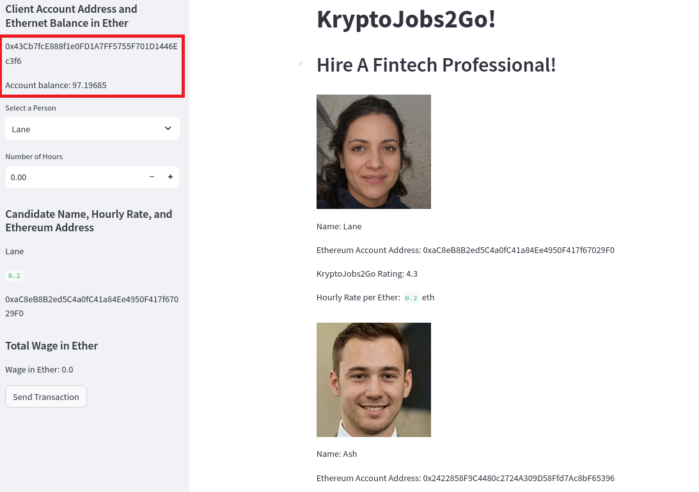
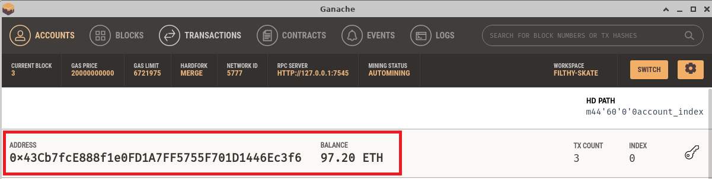
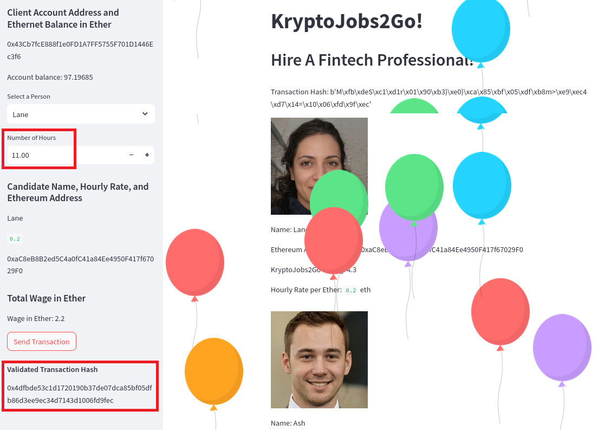
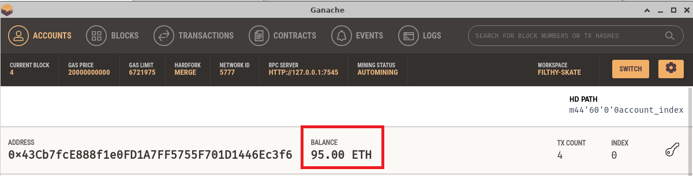
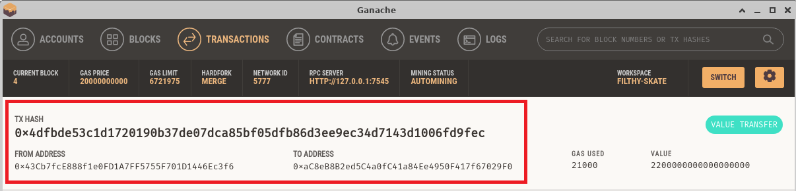

# Module 19 - Crypto Wallet

This is the page for the nineteenth module of the Fintech Bootcamp course, covering Blockchain Wallets.

This page is a continuation of my GitHub learning structure for this course.

Above you will see the *^*.py files for this homework along with resouces for the README.

## Wallet Features

We wrote a simple blockchain wallet in python using w3, streamlit and ganache.

This launched a website that enabled hiring of fintech professionals with payment via cryptocurrency transactions.

The application interfaces with Ethereum and all transaction details are shown.

## Fintech Professional Employment

* __*1 - Hiring*__
   
  I hired Lane to do 11 hours of work. I highlight my account address and balance of 97.2 ETH.
  11 hours at 0.2 ETH is 2.2 ETH total. So we expect 95 ETH to be remaining.

  

 

  

 

* __*2 - Payment*__
   
  I sent the 2.2 ETH to Lane for the work which is shown, along with the transaction hash.

  

 

  This is reflected in my wallet.

  

 

* __*3 - Transaction Validation*__
 
  All details of the transaction are recorded in the transaction log.

  

 

## Challenges

This is all running on Ubuntu, so I had a number of challenges with getting the starter code working.

I had to import some extra modules, change some called functions as well as roll back to web3 5.24 as web3 6 wouldn't work at all.

Interested learning process once again highlighting how important environment set up is.

## Back to Fintech Home

* [Fintech Bootcamp Home](https://github.com/d4np3/fintech)
